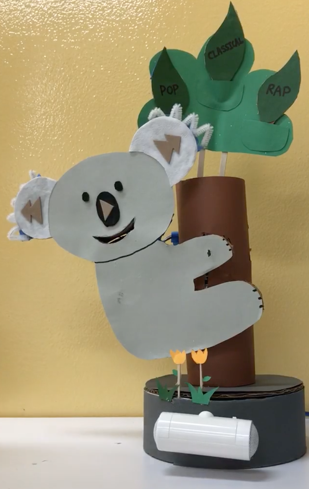

# ME 216M: Koala MP3 Player
Claire Huang and King Alandy Dy

To play/pause, skip forward, and skip back, press the appropriate buttons on the koala's face. To adjust volume, slide the koala up and down the tree. To select playlists of songs, insert leaves into the koala's mouth (it will detect the playlist ID by the RFID chips embedded in the leaves). [Demo video](https://vimeo.com/264909406)!

